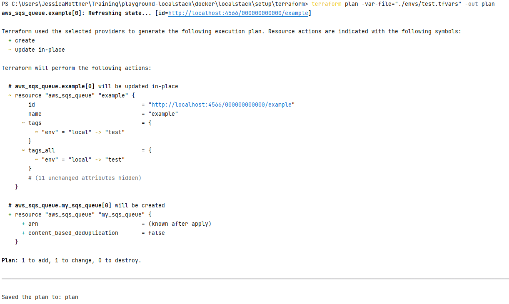
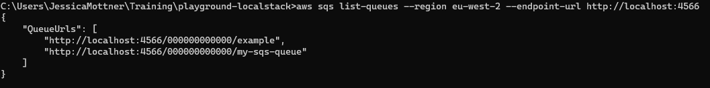

# Infrastructure Playground

A playground setup with examples to train your terraform and docker skills, this is reusing docker image localstack to abstract AWS services. 

## Getting started

### Pre-requisites
- [x] Docker

### Run localstack

To start localstack:

```shell
docker-compose up
```

This will set a default SQS queue to test the setup:

```shell
aws sqs list-queues --region eu-west-2 --endpoint-url http://localhost:4566
```

To stop localstack:
```shell
docker-compose down
```

### Add new TF resources (without rebuilding whole stack)

While localstack is running, you can add dynamically resources. This will avoid having to rebuild a new image everytime you need a resource.

The next command lines will be run in `./localstack/setup/terraform` folder.

First time, run the init command:

```shell
terraform init
```

Add your resources in the main.tf file or create a new TF file in this folder. Then: 

Example:
```hcl
resource "aws_sqs_queue" "my_sqs_queue" {
  count = var.create_resources ? 1 : 0
  name  = "my-sqs-queue"
  tags  = local.default_tags
}
```

```shell
terraform plan -var-file="./envs/test.tfvars" -out plan
```



If you are happy with the plan, apply it to your localstack environment:

```shell
terraform apply "plan"
```
